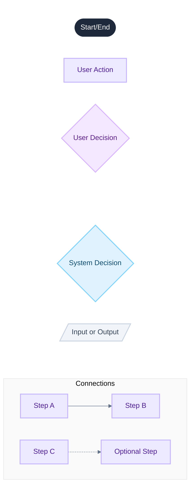

# User Flow Diagram Key

Visual reference for node types used in user flow diagrams.

## Node Types

| Node                | Shape                | Color      | Use For                          |
| ------------------- | -------------------- | ---------- | -------------------------------- |
| **Start/End**       | Stadium `([])`       | Slate 800  | Entry and exit points of a flow  |
| **User Action**     | Rectangle `[]`       | Violet 100 | Steps the user actively performs |
| **User Decision**   | Diamond `{}`         | Purple 100 | Choices made by the user         |
| **System Decision** | Diamond `{}`         | Sky 100    | Automated/conditional logic      |
| **Data I/O**        | Parallelogram `[//]` | Slate 100  | Information entering or leaving  |

## Connection Types

| Connection          | Syntax         | Use For                                |
| ------------------- | -------------- | -------------------------------------- |
| **Flow**            | `-->`          | Standard progression between steps     |
| **Optional/Repeat** | `-.->`         | Loops, optional paths, or return flows |
| **Labeled**         | `--\|Label\|>` | Conditional branches with descriptions |

## Color Palette

| Role            | Background | Border    | Text      |
| --------------- | ---------- | --------- | --------- |
| Start/End       | `#1e293b`  | `#1e293b` | `#ffffff` |
| User Action     | `#ede9fe`  | `#c4b5fd` | `#4c1d95` |
| User Decision   | `#f3e8ff`  | `#d8b4fe` | `#581c87` |
| System Decision | `#e0f2fe`  | `#7dd3fc` | `#0c4a6e` |
| Data I/O        | `#f1f5f9`  | `#cbd5e1` | `#334155` |
| Subgraph        | `#fafafa`  | `#e5e5e5` | —         |
| Lines           | —          | `#64748b` | —         |
