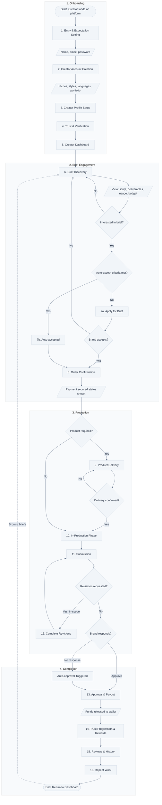

# UGC Platform User Flows

This document contains the user flow diagrams for the UGC Creator App, visualizing the end-to-end journeys for both Brands and Creators.

---

## Questions for Product Sponsor

The following questions need clarification before finalizing the implementation:

### 1. Auto-accept Path Convergence

After "Creator sourcing", do manual selection and auto-accept both converge at "Booking and escrow", or does auto-accept skip steps entirely?

**Current assumption**: Both paths converge at the same escrow step, with auto-accept simply automating the selection decision.

### 2. Revision Limits Edge Case

What happens when the revision limit is reached but the brand still requests changes?

- Does this trigger dispute escalation?
- Can the brand pay for additional revisions?
- Is auto-approval forced?

### 3. Product Delivery Timeout

What happens if tracking shows the product as delivered but the creator doesn't confirm receipt?

- Is there a timeout period?
- Does tracking confirmation auto-advance the workflow?
- What dispute mechanism exists?

### 4. Usage Monitoring Requirements

Is connecting ad accounts required for paid usage jobs, or is it optional with manual verification as fallback?

- Required: Jobs with paid usage cannot proceed without connected accounts
- Optional: Brands can manually verify/report usage compliance

---

## Brand User Flow

```mermaid
%%{init: {'theme': 'base', 'themeVariables': {
  'primaryColor': '#f1f5f9',
  'primaryTextColor': '#1e293b',
  'primaryBorderColor': '#cbd5e1',
  'lineColor': '#64748b',
  'secondaryColor': '#e2e8f0',
  'tertiaryColor': '#f8fafc'
}}}%%

flowchart TD
    subgraph Onboarding["1. Onboarding"]
        A([Start: Brand lands on platform]) --> B[1. Entry & Expectation Setting]
        B --> C[/Brand name, email, password/]
        C --> D[2. Brand Account Creation]
        D --> E[3. Subscription Selection]
        E --> F[/Website, logo, social accounts/]
        F --> G[4. Onboarding & Verification]
        G --> H[5. Brand Dashboard]
    end

    subgraph BriefCreation["2. Brief Creation"]
        H --> I[/Product, audience, deliverables, budget/]
        I --> J[6. Create Brief]
        J --> K[7. AI Script Generation]
        K --> L{Script acceptable?}
        L -->|Edit/Regenerate| K
        L -->|Approve| M[8. Script Approval & Lock]
    end

    subgraph CreatorEngagement["3. Creator Engagement"]
        M --> N[9. Creator Sourcing]
        N --> O{Auto-accept enabled?}
        O -->|Yes| P[Set criteria: level, score, badges]
        O -->|No| Q[10a. Manual Creator Selection]
        P --> R[10b. Auto-accept Path]
        Q --> S[11. Booking & Escrow]
        R --> S
        S --> T[/Payment secured in escrow/]
    end

    subgraph Production["4. Production"]
        T --> U{Product required?}
        U -->|Yes| V[12. Product Shipping]
        V --> W[/Courier & tracking details/]
        W --> X{Delivery confirmed?}
        X -->|No| W
        X -->|Yes| Y[13. In-Production Phase]
        U -->|No| Y
        Y --> Z[14. Submission & Review]
    end

    subgraph Completion["5. Completion"]
        Z --> AA{Revisions needed?}
        AA -->|Yes, in-scope| AB[Request Revision]
        AB --> Z
        AA -->|No| AC{Brand responds?}
        AC -->|Approve| AD[15. Approval & Payout]
        AC -->|No response| AE[Auto-approval Triggered]
        AE --> AD
        AD --> AF[16. Usage Compliance & Monitoring]
        AF --> AG{Usage exceeds scope?}
        AG -->|Yes| AH[Notify & offer extension]
        AG -->|No| AI[17. Completion & Trust Progression]
        AH --> AI
        AI --> AJ[18. Repeat Usage]
        AJ --> AK([End: Return to Dashboard])
        AK -.->|New brief| H
    end
```

### Brand Flow Steps Summary

| Step | Name | Type |
|------|------|------|
| 1 | Entry & Expectation Setting | Process |
| 2 | Brand Account Creation | Process + Input |
| 3 | Subscription Selection | Process |
| 4 | Onboarding & Verification | Process + Input |
| 5 | Brand Dashboard | Process |
| 6 | Create Brief | Process + Input |
| 7 | AI Script Generation | Process |
| 8 | Script Approval & Lock | Process + Decision |
| 9 | Creator Sourcing | Process |
| 10 | Creator Selection / Auto-accept | Decision |
| 11 | Booking & Escrow | Process + Output |
| 12 | Product Shipping | Process + Input (conditional) |
| 13 | In-Production Phase | Process |
| 14 | Submission & Review | Process |
| 15 | Approval & Payout | Process + Decision |
| 16 | Usage Compliance & Monitoring | Process + Decision |
| 17 | Completion & Trust Progression | Process |
| 18 | Repeat Usage | Process |

---

## Creator User Flow

### Creator Flow Steps Summary

| Step | Name | Type |
|------|------|------|
| 1 | Entry & Expectation Setting | Process |
| 2 | Creator Account Creation | Process + Input |
| 3 | Creator Profile Setup | Process + Input |
| 4 | Trust & Verification | Process |
| 5 | Creator Dashboard | Process |
| 6 | Brief Discovery | Process |
| 7 | Apply / Auto-accept | Decision |
| 8 | Order Confirmation | Process + Output |
| 9 | Product Delivery | Process (conditional) |
| 10 | In-Production Phase | Process |
| 11 | Submission | Process |
| 12 | Revisions | Process + Decision (conditional) |
| 13 | Approval & Payout | Process |
| 14 | Trust Progression & Rewards | Process |
| 15 | Reviews & History | Process |
| 16 | Repeat Work | Process |

---

## Flow Symbol Legend

| Symbol | Shape | Meaning |
|--------|-------|---------|
| `([text])` | Oval/Stadium | Start or End point |
| `[text]` | Rectangle | Process step |
| `{text}` | Diamond | Decision point |
| `[/text/]` | Parallelogram | Input or Output |
| `-->` | Arrow | Flow direction |
| `-.->` | Dashed arrow | Optional/repeat path |
| `subgraph` | Container | Logical phase grouping |
